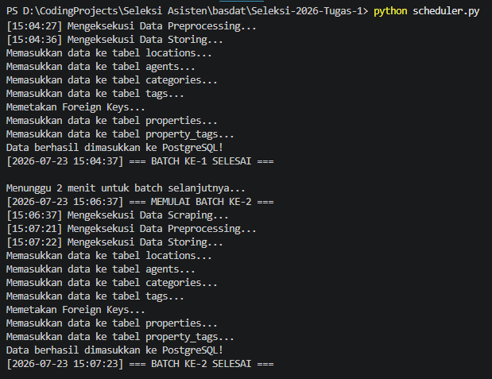
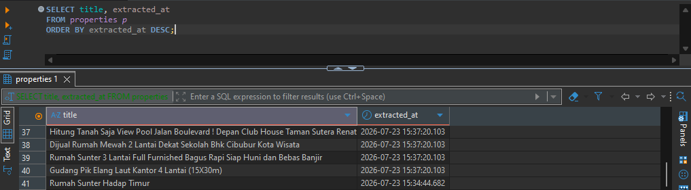

# Sistem Informasi Properti Rumah123 — ETL, Perancangan Basis Data, dan RDBMS

Proyek ini dibuat untuk memenuhi Seleksi Tahap 2 Asisten Lab Basis Data 2026, dengan cakupan penuh mulai dari *scraping* data, perancangan ERD, translasi ke skema relasional, hingga implementasi database PostgreSQL yang fungsional lengkap dengan tiga bonus (Data Warehouse, Automated Scheduling, dan Query Optimization).

---

## 1. Identitas Penulis

| | |
|---|---|
| **Nama** | Abhinaya Rajendra Fargaz (Abhin) |
| **NIM** | 18224087 |
| **Akun GitHub** | [kelekers](https://github.com/kelekers) |
| **Mata Kuliah** | Basis Data |

---

## 2. Latar Belakang & Alasan Pemilihan Topik

Topik yang saya pilih adalah **Rumah123**, sebuah portal direktori properti dan perumahan di Indonesia. Datanya saya ambil langsung dari halaman listing properti di situs tersebut.

Ada dua alasan utama kenapa saya jatuhkan pilihan ke topik ini:

1. **Struktur datanya jelas dan sangat cocok untuk relational modeling.** Satu listing properti punya banyak atribut yang secara natural bisa dipecah menjadi entitas terpisah — lokasi, agen penjual, kategori tipe rumah, dan tag/fasilitas. Ini bikin domain properti jadi contoh yang bagus untuk menunjukkan desain relasi One-to-Many maupun Many-to-Many di RDBMS, tanpa harus dipaksakan.
2. **Cukup modular untuk dikembangkan lebih jauh.** Karena strukturnya sudah rapi sejak awal, saya jadi punya ruang untuk mengerjakan task bonus (automated scheduling, data warehouse, query optimization) sekaligus menambahkan tabel-tabel fungsional baru seperti `inquiries`, `reviews`, dan `viewing_schedules` yang relevan dengan domain properti tapi belum tentu ada datanya dari hasil scraping.

---

## 3. Struktur Direktori Proyek

```text
Seleksi-2026-Tugas-1/
|   README.MD
│   requirements.txt
│   scheduler.py
│   scheduler_proof-1.png
│   scheduler_proof-2.png
│   
├───Data Scraping
│   ├───data
│   │       .gitkeep
│   │       clean_agents.json
│   │       clean_categories.json
│   │       clean_locations.json
│   │       clean_properties.json
│   │       clean_property_tags.json
│   │       clean_tags.json
│   │       raw_agents.json
│   │       raw_locations.json
│   │       raw_properties.json
│   │       
│   └───src
│       │   .gitkeep
│       │   preprocessor.py
│       │   scraper.py
│       │   
│       └───__pycache__
│               preprocessor.cpython-311.pyc
│               scraper.cpython-311.pyc
│               
├───Data Storing
│   ├───design
│   │       .gitkeep
│   │       ERD.png
│   │       Relational_Diagram.png
│   │       
│   ├───export
│   │       .gitkeep
│   │       rumah123_db_backup.sql
│   │       schema.sql
│   │       
│   ├───screenshots
│   │       .gitkeep
│   │       agent.png
│   │       location.png
│   │       price.png
│   │       tag.png
│   │       title.png
│   │       
│   └───src
│       │   .gitkeep
│       │   storing.py
│       │   
│       └───__pycache__
│               storing.cpython-311.pyc
│               
├───Data Warehouse
│   ├───design
│   │       .gitkeep
│   │       ERD.png
│   │       Relational_Diagram.png
│   │       
│   ├───export
│   │       .gitkeep
│   │       rumah123_db_backup.sql
│   │       schema.sql
│   │       
│   ├───screenshots
│   │       .gitkeep
│   │       avg_price.png
│   │       price_facility.png
│   │       rank_agent.png
│   │       
│   └───src
│       │   .gitkeep
│       │   load_warehouse.py
│       │   
│       └───__pycache__
│               load_warehouse.cpython-311.pyc
│               
├───Query Optimasi
│   ├───export
│   │       optimization.sql
│   │       
│   └───screenshots
│           query1-1.png
│           query1-2.png
│           query2-1.png
│           query2-2.png
│           query3-1.png
│           query3-2.png
```

Struktur ini sengaja saya pisah tegas antara tahap ekstraksi (*Data Scraping*), penyimpanan (*Data Storing*), dan warehouse, supaya setiap tahap ETL bisa ditelusuri dan dijalankan secara independen tanpa saling mengganggu.

---

## 4. Environment & Dependensi

Sebelum menjalankan proyek, pastikan sudah tersedia:

- Python 3.x
- PostgreSQL (sudah terpasang dan service-nya berjalan)
- Google Chrome + ChromeDriver yang kompatibel (dikelola otomatis lewat `webdriver-manager`)

Install seluruh dependensi Python dengan:

```bash
pip install -r requirements.txt
```

Library utama yang dipakai:

| Library | Fungsi |
|---|---|
| `selenium` | Merender halaman dinamis (SPA) dan mensimulasikan browser |
| `webdriver-manager` | Auto-manage versi ChromeDriver |
| `beautifulsoup4` | Parsing HTML setelah halaman selesai dirender |
| `pandas` | Bantu proses cleaning dan transformasi data tabular |
| `psycopg2-binary` | Koneksi Python ke PostgreSQL |
| `requests` | Sempat dicoba di awal, sekarang hanya dependency sisa (lihat bagian 8) |

---

## 5. Quick Start: Setup Database PostgreSQL

Langkah pertama yang **wajib** dilakukan sebelum menjalankan skrip `storing.py` adalah membuat database kosong bernama `rumah123_db`. Saya coba dua cara berikut dan keduanya berhasil, jadi silakan pilih yang lebih nyaman:

**Opsi A — lewat pgAdmin4:**
Connect ke server > klik kanan Databases > Create > Database, lalu beri nama `rumah123_db`.

**Opsi B — lewat terminal:**
```bash
createdb -U postgres rumah123_db
```

atau masuk ke `psql` lalu jalankan:

```sql
CREATE DATABASE rumah123_db;
```

Setelah database kosong tersedia, restore skema tabelnya:

```bash
psql -U postgres -d rumah123_db -f "Data Storing/export/schema.sql"
```

Jika ingin langsung memakai data hasil scraping saya tanpa menjalankan pipeline dari nol, restore file backup:

```bash
psql -U postgres -d rumah123_db -f "Data Storing/export/rumah123_db_backup.sql"
```

> **Catatan konfigurasi:** `storing.py` dan `load_warehouse.py` memakai kredensial default (`user=postgres`, `host=localhost`, `port=5432`, `dbname=rumah123_db`). Kalau environment berbeda, tinggal sesuaikan variabel `DB_CONFIG` di masing-masing file tersebut.

---

## 6. Alur ETL & Cara Menjalankan

### 6.1 Menjalankan Scraper

```bash
cd "Data Scraping/src"
python scraper.py
```

Scraper akan membuka Rumah123, menyusuri listing properti sebanyak 35 halaman, lalu menyimpan hasil mentahnya ke:
- `raw_properties.json`
- `raw_locations.json`
- `raw_agents.json`

### 6.2 Preprocessing

Jalankan setelah proses scraping selesai:

```bash
python preprocessor.py
```

Skrip ini membersihkan dan memecah data mentah menjadi entitas-entitas relasional siap pakai:
- `clean_properties.json`
- `clean_categories.json`
- `clean_locations.json`
- `clean_agents.json`
- `clean_tags.json`
- `clean_property_tags.json`

### 6.3 Data Storing

```bash
cd "Data Storing/src"
python storing.py
```

Skrip ini membaca seluruh file `clean_*.json` dan memasukkannya ke tabel-tabel di PostgreSQL, sambil melakukan pemetaan foreign key dari nama entitas ke id integer masing-masing tabel dimensi.

**Bukti Eksekusi Storing Database:**


### 6.4 Automated Scheduling (Bonus 2)

`scheduler.py` menjalankan seluruh pipeline (`scraper.py` → `preprocessor.py` → `storing.py`) secara otomatis lewat `subprocess.run`, dengan parameter `cwd` yang diset eksplisit ke folder masing-masing skrip:

```python
subprocess.run(["python", "scraper.py"], cwd="Data Scraping/src")
subprocess.run(["python", "preprocessor.py"], cwd="Data Scraping/src")
subprocess.run(["python", "storing.py"], cwd="Data Storing/src")
```

Pendekatan `cwd` ini penting supaya path relatif di dalam setiap skrip (misalnya lokasi file JSON) tetap valid meskipun `scheduler.py` sendiri dijalankan dari direktori root proyek.

Untuk mensimulasikan pembaruan data berkala, scheduler menjalankan dua batch dengan jeda 2 menit di antaranya:

```python
print("Menunggu 2 menit untuk batch selanjutnya...")
time.sleep(120)
run_etl_batch(2)
```

Detail lebih lanjut soal ini ada di bagian 9.

---

## 7. Struktur & Penjelasan File JSON

### Tahap Raw (hasil langsung dari scraper)

**`raw_properties.json`** — setiap entri berisi:
`property_id`, `title`, `category`, `raw_price`, `raw_installment_15y`, `raw_installment_20y`, `raw_location`, `raw_bedrooms`, `raw_bathrooms`, `raw_garages`, `raw_building_area`, `raw_land_area`, `total_facilities`, `raw_tags`, `agent_name`.

**`raw_locations.json`** — hanya berisi nama lokasi mentah (`raw_location`), belum dipecah jadi kota/kecamatan.

**`raw_agents.json`** — berisi `agent_name` dan `raw_phone_prefix`.

### Tahap Clean (hasil preprocessing, siap masuk database)

| File | Isi |
|---|---|
| `clean_properties.json` | Properti dengan referensi ke lokasi, kategori, agen, serta atribut numerik yang sudah dikonversi (harga, cicilan, jumlah kamar, luas, dsb.) |
| `clean_categories.json` | Daftar kategori tipe properti yang unik |
| `clean_locations.json` | Lokasi dengan atribut `city` dan `district` yang sudah dipisah |
| `clean_agents.json` | Data agen dan `phone_prefix` |
| `clean_tags.json` | Daftar tag/fasilitas properti yang unik |
| `clean_property_tags.json` | Tabel pemetaan relasi many-to-many antara properti dan tag |

Kenapa dipecah sebanyak ini, bukan digabung jadi satu file besar? Karena setiap file di atas nantinya map 1-ke-1 dengan satu tabel di database, jadi begitu masuk ke tahap `storing.py`, prosesnya tinggal load-per-file tanpa perlu parsing ulang struktur bersarang yang rumit.

---

## 8. Tantangan Teknis & Keputusan Implementasi

Bagian ini saya tulis sebagai catatan proses supaya penguji bisa lihat alasan di balik setiap keputusan teknis, bukan cuma hasil akhirnya.

### 8.1 Dari `requests` ke `Selenium`

Percobaan pertama saya scraping pakai `requests` biasa, tapi hasilnya HTML kosong — nggak ada data properti sama sekali di response-nya. Setelah saya cek lewat *Inspect Element*, ternyata Rumah123 dibangun sebagai *Single Page Application* yang me-render konten listing lewat JavaScript setelah halaman awal dimuat. Artinya `requests` cuma dapat kerangka HTML-nya saja, bukan konten final yang dilihat user.

Solusinya, saya pindah ke **Selenium** dengan ChromeDriver, yang benar-benar membuka browser (headless) dan menunggu JavaScript-nya jalan sebelum ambil HTML final. Beberapa opsi Chrome yang saya set:
- `--disable-gpu`
- `--window-size=1920x1080`
- `user-agent` desktop, biar Rumah123 nggak nampilin versi mobile yang strukturnya beda

Karena rendering JS butuh waktu, saya tambahkan `time.sleep(5)` di setiap pergantian halaman supaya elemen sempat termuat penuh sebelum discrape. Total saya scrape sampai 35 halaman untuk dapat volume data yang cukup buat analisis nanti.

### 8.2 Kenapa Hardcode "Rp" dan Bukan Seleksi Tag HTML

Rencana awal, saya mau seleksi elemen berdasarkan tag standar seperti `h1` untuk judul atau `span`/`strong` untuk harga. Ternyata di lapangan struktur DOM Rumah123 nggak konsisten, class dan susunan tag-nya bisa beda antar listing, jadi selector generik sering nembak elemen yang salah atau malah gagal ambil apa-apa.

Setelah diskusi lebih jauh soal pendekatan yang lebih tahan banting, saya ganti strategi jadi berbasis **pola teks**, bukan struktur tag:
- untuk harga, saya cari elemen mana pun yang teksnya mengandung `"Rp"`, alih-alih bergantung pada tag/class tertentu
- untuk info agen, lokasi, dan badge fasilitas, saya pakai kombinasi keyword serupa dengan fallback ke beberapa pola alternatif

Pendekatan ini lebih defensif dan lebih tahan terhadap perubahan kecil di struktur halaman, walau konsekuensinya kode jadi lebih "kotor" secara estetika dibanding seleksi tag yang rapi. Trade-off yang saya ambil sengaja: lebih baik scraper tetap jalan meski situsnya sedikit berubah, daripada scraper rapuh yang gampang patah.

### 8.3 Normalisasi Data

Data mentah dari scraper masih dalam bentuk teks dan tidak konsisten, jadi tahap preprocessing melakukan beberapa transformasi:

- **Konversi nominal:** `raw_price`, `raw_installment_15y`, `raw_installment_20y` diubah dari string berformat rupiah menjadi bilangan bulat murni.
- **Konversi ukuran & jumlah:** `raw_building_area`, `raw_land_area`, `raw_bedrooms`, `raw_bathrooms`, `raw_garages` diparsing jadi integer, dan `total_facilities` diproses jadi `facilities_count`.
- **Penghapusan duplikat:** entri yang punya `property_id` sama disaring supaya nggak dobel masuk database.
- **Penanganan nilai kosong:** ini bagian yang perlu kehati-hatian ekstra. Nilai `0` (baik sebagai angka maupun string `"0"`) saya konversi jadi `NULL` saat proses storing, karena `0` di konteks properti (misalnya 0 kamar mandi) biasanya berarti datanya memang tidak tersedia, bukan benar-benar nol. Sementara itu, label teks `"unknown"` sengaja **tidak** saya ubah jadi `NULL` — nilai itu tetap disimpan apa adanya, karena "unknown" masih merupakan informasi yang eksplisit ditampilkan situs (berbeda makna dengan data yang benar-benar kosong/hilang).

### 8.4 Mengatasi Duplikasi Saat Storing: `ON CONFLICT DO NOTHING`

Karena proses scraping bisa dijalankan berkali-kali (apalagi dengan adanya scheduler di Bonus 2), ada risiko entitas yang sama di-insert ulang dan menyebabkan pelanggaran `UNIQUE constraint`.

Untuk menghindari ini tanpa harus melakukan pengecekan manual satu-satu sebelum insert, saya pakai klausa PostgreSQL:

```sql
INSERT INTO locations (location_name, city, district)
VALUES (%s, %s, %s)
ON CONFLICT (location_name) DO NOTHING;
```

Pola ini saya terapkan konsisten di semua tabel dimensi (`locations`, `agents`, `categories`, `tags`) dan juga di tabel bridge `property_tags`. Efeknya, skrip `storing.py` jadi *idempotent* yaitu aman dijalankan ulang kapan pun tanpa memunculkan data duplikat atau error karena constraint violation.

---

## 9. Desain ERD & Skema Relasional

### 9.1 Ringkasan Relasi

- `locations` **1 → N** `properties`
- `agents` **1 → N** `properties`
- `categories` **1 → N** `properties`
- `tags` **N ↔ M** `properties`, dijembatani lewat `property_tags`
- Tabel tambahan (`inquiries`, `reviews`, `viewing_schedules`) masing-masing **1 → N** dari `properties`, sebagai antisipasi kebutuhan fitur ke depan

### 9.2 Skema DBML

```dbml
Table locations {
  location_id serial [pk]
  location_name varchar [unique, not null]
  city varchar
  district varchar
}

Table agents {
  agent_id serial [pk]
  agent_name varchar [unique, not null]
  phone_prefix varchar
}

Table categories {
  category_id serial [pk]
  category_name varchar [unique, not null]
}

Table tags {
  tag_id serial [pk]
  tag_name varchar [unique, not null]
}

Table properties {
  property_id varchar [pk]
  title text [not null]
  price bigint
  installment_15y bigint
  installment_20y bigint
  bedrooms int
  bathrooms int
  garages int
  building_area int
  land_area int
  facilities_count int
  category_id int
  location_id int
  agent_id int
  extracted_at timestamp
}

Table property_tags {
  property_id varchar
  tag_id int
  Indexes {
    (property_id, tag_id) [pk]
  }
}

// --- Tabel tambahan ---
Table inquiries {
  inquiry_id serial [pk]
  property_id varchar
  visitor_name varchar
  message text
  inquiry_date timestamp
}

Table reviews {
  review_id serial [pk]
  property_id varchar
  rating int
  comment text
  review_date timestamp
}

Table viewing_schedules {
  schedule_id serial [pk]
  property_id varchar
  visitor_name varchar
  scheduled_date timestamp
  status varchar
}

// --- Definisi relasi ---
Ref: properties.category_id > categories.category_id
Ref: properties.location_id > locations.location_id
Ref: properties.agent_id > agents.agent_id

Ref: property_tags.property_id > properties.property_id
Ref: property_tags.tag_id > tags.tag_id

Ref: inquiries.property_id > properties.property_id
Ref: reviews.property_id > properties.property_id
Ref: viewing_schedules.property_id > properties.property_id
```

**Entity Relationship Diagram (ERD):**


**Diagram Relasional:**


### 9.3 Proses Translasi ERD ke Diagram Relasional

**Relasi One-to-Many.**
Contoh paling jelas ada di relasi `categories` ke `properties`: satu kategori bisa dimiliki banyak properti, tapi satu properti cuma punya satu kategori. Translasinya simpel, primary key `category_id` dari tabel `categories` diturunkan jadi foreign key di tabel `properties`. Pola yang sama saya terapkan untuk `locations` dan `agents` terhadap `properties`. Aturan `ON DELETE RESTRICT` saya terapkan di sini supaya kategori/lokasi/agen tidak bisa terhapus selama masih ada properti yang mereferensikannya (mencegah orphaned foreign key secara tidak sengaja).

**Relasi Many-to-Many.**
Kasusnya ada di relasi `properties` dengan `tags`: satu properti bisa punya banyak tag (misalnya "dekat sekolah", "carport", "hook"), dan satu tag yang sama bisa melekat di banyak properti. Karena relasi N-to-N tidak bisa direpresentasikan langsung di model relasional, saya buat tabel bridge `property_tags` dengan composite primary key `(property_id, tag_id)`. Di sini saya pakai `ON DELETE CASCADE`, supaya kalau sebuah properti dihapus, seluruh mapping tag-nya ikut terhapus otomatis tanpa meninggalkan baris "yatim" di tabel bridge.

**Tabel tambahan.**
`inquiries`, `reviews`, dan `viewing_schedules` sengaja dirancang sebagai perluasan skema yang relevan secara domain (interaksi calon pembeli dengan listing), tapi memang tidak diisi data. Sesuai ketentuan tugas, tabel tambahan cukup dibiarkan kosong sebagai bukti kemampuan desain skema, bukan bagian dari hasil scraping.

---

## 10. Bonus 1: Data Warehouse

Sebagai pengembangan dari database operasional di atas, saya juga menyiapkan lapisan data warehouse sederhana di folder `Data Warehouse/`, dengan skrip `load_warehouse.py` yang memuat data dari `rumah123_db` (sumber operasional) ke skema warehouse terpisah.

Topik properti yang saya pilih ini sejak awal sudah sangat condong dan siap digunakan untuk arsitektur Data Warehouse. Skema operasional yang sangat modular mempermudah penerapan **star schema**: `properties` bertindak sebagai fact table (karena berisi ukuran kuantitatif seperti harga dan luas), sementara `locations`, `agents`, `categories`, dan `tags` berperan sebagai dimension table yang memperkaya konteks setiap baris fakta. Struktur skema warehouse dan contoh query analitiknya (misalnya rata-rata harga per kota, atau distribusi kategori per kecamatan) ada di `Data Warehouse/src/load_warehouse.py` dan `Data Warehouse/export/`.

**Bukti Eksekusi Data Warehouse:**


---

## 11. Bonus 2: Automated Scheduling

Fitur automated scheduling diimplementasikan lewat `scheduler.py` di root proyek, dengan tujuan menjalankan seluruh pipeline ETL secara berkala tanpa campur tangan manual.

**Cara kerja:**
1. `scheduler.py` memanggil `scraper.py`, `preprocessor.py`, dan `storing.py` secara berurutan lewat `subprocess.run`, masing-masing dengan parameter `cwd` yang eksplisit menunjuk ke folder skrip terkait (`Data Scraping/src` atau `Data Storing/src`).
2. Setelah batch pertama selesai, scheduler menunggu 2 menit (`time.sleep(120)`) sebelum menjalankan batch kedua. Jeda ini bertujuan menghindari beban berlebih atau potensi pemblokiran dari server target, sekaligus mensimulasikan siklus pembaruan data berkala.
3. Setiap kali properti disimpan, kolom `extracted_at` diisi dengan timestamp saat proses storing dijalankan. Dengan begini, batch pertama dan batch kedua bisa dibedakan lewat timestamp-nya, walaupun `property_id`-nya sama.

**Soal redundansi data:** karena `storing.py` sudah memakai `ON CONFLICT DO NOTHING` (lihat bagian 8.4), menjalankan scheduler berkali-kali tidak akan menghasilkan baris data duplikat di tabel dimensi maupun tabel `properties`. Yang berubah antar batch murni nilai `extracted_at`, bukan jumlah baris.

**Catatan soal staging:** pada implementasi saat ini, file JSON hasil scraping (`clean_*.json`) ditimpa ulang setiap batch, karena tujuannya masih simulasi lokal. Untuk skala enterprise yang butuh audit historis penuh, pendekatan yang lebih ideal adalah memberi nama file berbasis timestamp per batch, sehingga staging area menyimpan riwayat, bukan cuma snapshot terakhir.

**Bukti Eksekusi Penjadwalan Berkala:**



---

## 12. Bonus 3: Optimasi Query

Tiga strategi optimasi saya kumpulkan di `Query Optimasi/export/optimization.sql`, masing-masing dengan komentar penjelasan fungsinya:

1. **Covering index** pada kolom yang sering dipakai untuk filter dan join:
   ```sql
   CREATE INDEX IF NOT EXISTS idx_properties_cat_cover
   ON properties(category_id) INCLUDE (title, price);
   ```
   Index ini membuat query yang memfilter berdasarkan `category_id` sekaligus menampilkan `title` dan `price` bisa dijawab langsung dari index tanpa perlu akses ke heap table (*index-only scan*).

2. **Materialized view** `mv_city_category_stats` untuk agregasi harga dan jumlah listing per kota-kategori. Query analitik yang sebelumnya harus menghitung ulang `GROUP BY` dari jutaan baris tiap kali dipanggil, sekarang cukup membaca hasil yang sudah dihitung sebelumnya, jauh lebih cepat untuk laporan yang sering diakses.

3. **Query rewriting** dari pola `COUNT(*) > 0` menjadi `EXISTS (...)` untuk pengecekan keberadaan data. `EXISTS` berhenti scan begitu menemukan baris pertama yang cocok, sementara `COUNT(*)` tetap menghitung seluruh baris yang match — jadi jauh lebih efisien untuk kasus yang hanya butuh jawaban ya/tidak.

**Bukti Perbandingan Kinerja:**


---

## 13. Catatan Konfigurasi Tambahan

- Kredensial database di `storing.py` dan `load_warehouse.py` diatur lewat variabel `DB_CONFIG` di masing-masing file. Sesuaikan kalau environment kamu beda dari default (`user=postgres`, `host=localhost`, `port=5432`).
- Backup database (`rumah123_db_backup.sql`) sudah saya export ulang dengan encoding UTF-8 untuk menghindari error karakter saat proses restore di environment lain.
- Struktur folder sempat saya rapikan ulang (termasuk penamaan folder `Data Warehouse`) — dokumentasi screenshot untuk perubahan ini ada di folder terkait.

---

## 14. Deklarasi Penggunaan AI

Saya ingin transparan soal bagaimana AI berperan (dan tidak berperan) dalam proses pengerjaan proyek ini.

**Yang secara sadar saya hindari:**
Saya sangat menghindari penggunaan AI yang terintegrasi langsung di dalam IDE seperti fitur auto-complete otomatis atau AI coding assistant yang menyarankan/menulis kode secara real-time saat saya mengetik. Keputusan ini saya ambil sejak awal supaya proses belajar tetap orisinal: saya ingin benar-benar bergulat dengan masalahnya sendiri, bukan menerima kode jadi begitu saja.

**Bagaimana AI benar-benar dipakai:**
AI (Gemini) saya gunakan murni secara *chat-based*, sebagai teman diskusi di luar editor. Alur kerja tipikalnya:
1. Saya sendiri yang melakukan inspeksi elemen HTML lewat *Inspect Element* di browser untuk memahami struktur halaman Rumah123.
2. Temuan itu saya bawa ke Gemini untuk brainstorming pendekatan dan menyusun draf awal kode ekstraksi.
3. Saya baca dan pahami kode yang dihasilkan, lalu saya jalankan dan evaluasi sendiri kalau ada yang tidak masuk akal atau errornya tidak jelas, saya diskusikan ulang atau saya cari solusinya sendiri.
4. Gemini juga saya pakai untuk menerjemahkan rancangan ERD kasar (yang saya buat sendiri di draw.io) ke format DBML, dan untuk merapikan (*refactor*) kode yang sudah berjalan tapi masih berantakan secara struktur.
5. Selain hal teknis kode, AI juga digunakan untuk membantu merapikan dokumentasi proyek seperti penyusunan README ini. Saya mendokumentasikan seluruh proses pengerjaan, kendala error, dan keputusan teknis secara kasar dari awal hingga akhir. Kemudian, AI membantu merangkai dan merapikan format catatan tersebut menjadi dokumen formal yang terstruktur. Seluruh isi dan narasi tetap berasal dari pengalaman saya pribadi.

**Bagian yang saya kerjakan sepenuhnya sendiri:**
- Riset dan penentuan topik data.
- Inspeksi manual struktur HTML target scraping.
- Desain awal ERD (konsep, entitas, relasi) di draw.io.
- Eksekusi, testing, dan debugging seluruh skrip.
- Keputusan desain database (constraint, indexing strategy, penanganan konflik data).
- Dokumentasi pengerjaan secara kasar.

AI membantu mempercepat bagian-bagian yang sifatnya translasi ide ke sintaks, misalnya saat saya sudah tahu logika apa yang saya mau, tapi belum hafal syntax `psycopg2` atau format DBML yang benar. Tapi keputusan arsitektural, debugging, dan pemahaman terhadap setiap baris kode tetap saya pegang sendiri.

---

## 15. Referensi

- Sumber data (target scraping): [rumah123.com](https://www.rumah123.com/)
- Dokumentasi PostgreSQL: [postgresql.org/docs](https://www.postgresql.org/docs/)
- Dokumentasi Selenium: [selenium-python.readthedocs.io](https://selenium-python.readthedocs.io/)
- Pembuatan Model ERD: [draw.io](https://app.diagrams.net/)
- Pembuatan Model Relasional: [dbdiagram.io](https://dbdiagram.io/)
- Library Python yang digunakan: `selenium`, `webdriver-manager`, `beautifulsoup4`, `pandas`, `psycopg2-binary`
- File backup database: `Data Storing/export/rumah123_db_backup.sql`
- File skema database: `Data Storing/export/schema.sql`
- File query optimasi: `Query Optimasi/export/optimization.sql`